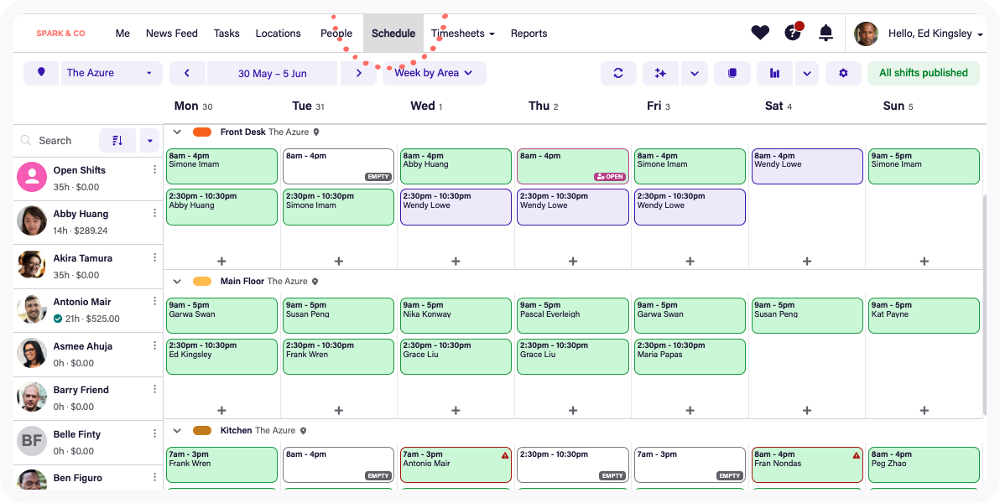
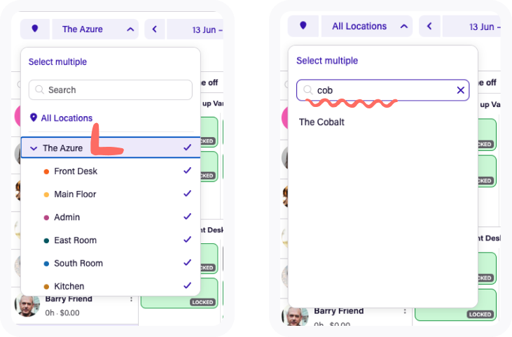
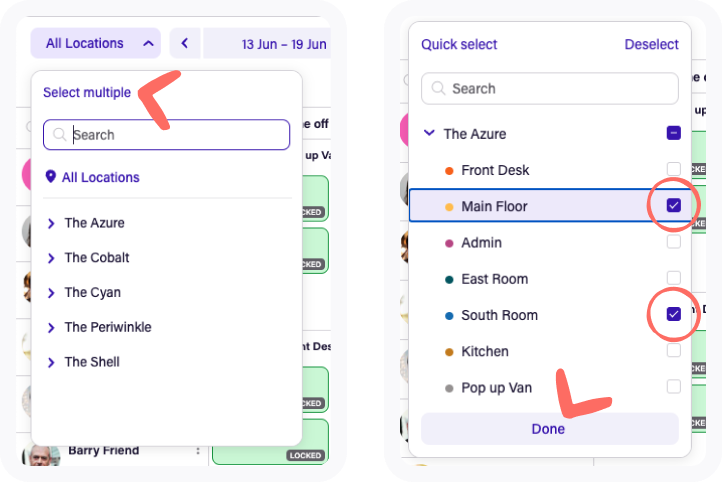
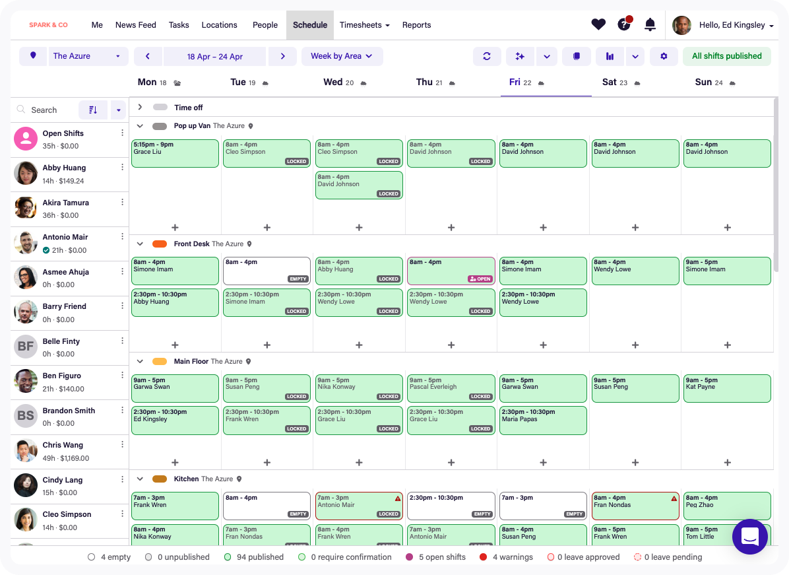
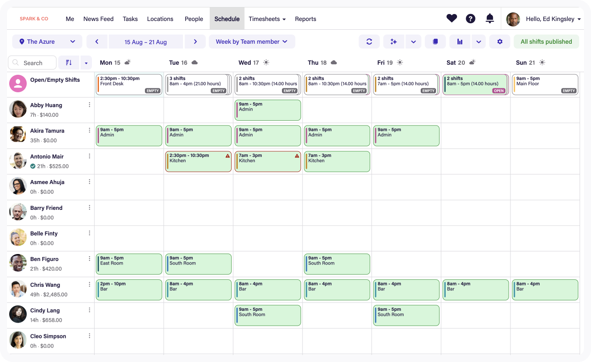
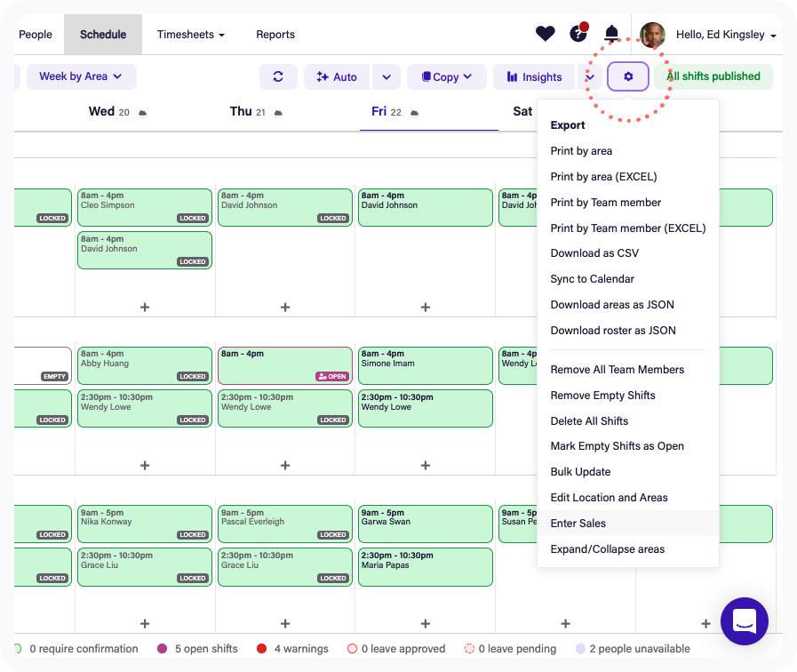
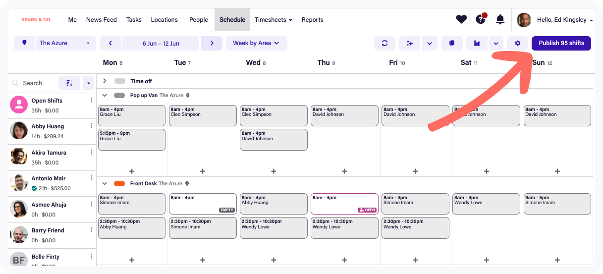
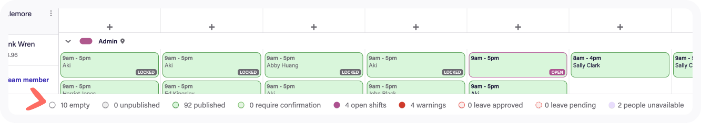

# Deputy Schedule Overview -> EMS Implementation Guide

This note is based on Deputy's **Schedule overview** article:

- Source: https://help.deputy.com/hc/en-au/articles/4688713423759-Schedule-overview
- Article updated: **10 April 2026**

The target is close Deputy visual and interaction parity inside this Laravel + Odoo app while retaining the current application shell and using only features supported by the real backend.

## Reference Screens

### Main schedule workspace



### Location / area filtering





### Two core schedule views





### Workspace actions







## What Deputy Is Really Doing

Deputy's schedule page is a single working surface with these building blocks:

1. A top toolbar for:
   - location / area selection
   - date navigation
   - view switching
   - refresh
   - copy / bulk actions
   - publish
2. A central grid that can be shown:
   - by area
   - by team member
3. A left roster panel with:
   - search
   - team hours
   - cost summary
   - quick actions
4. Inline shift operations:
   - create
   - edit
   - move
   - copy
   - bulk update
5. A bottom status strip showing:
   - empty
   - unpublished
   - published
   - open
   - warnings
   - leave / unavailable counts

That is the pattern we should reproduce.

## What Already Exists In This Repo

We already have a strong base:

- Manager Odoo shift creation/edit/delete page:
  [app/Http/Controllers/ManagerShiftController.php](../app/Http/Controllers/ManagerShiftController.php)
  [resources/views/admin/manager-shifts/create.blade.php](../resources/views/admin/manager-shifts/create.blade.php)
- Employee monthly shift self-view:
  [app/Http/Controllers/EmployeeShiftController.php](../app/Http/Controllers/EmployeeShiftController.php)
  [resources/views/admin/employee-shifts/index.blade.php](../resources/views/admin/employee-shifts/index.blade.php)
- Reusable month calendar builder:
  [app/Support/ShiftCalendarBuilder.php](../app/Support/ShiftCalendarBuilder.php)
- Odoo-backed planning services:
  [app/Services/Odoo/OdooManagerPlanningService.php](../app/Services/Odoo/OdooManagerPlanningService.php)
  [app/Services/Odoo/OdooPlanningService.php](../app/Services/Odoo/OdooPlanningService.php)
- Existing routes for manager and employee shift flows:
  [routes/web.php](../routes/web.php)

There is also an older local schedule module:

- [app/Http/Controllers/StaffScheduleController.php](../app/Http/Controllers/StaffScheduleController.php)
- [resources/views/admin/staffSchedule/list.blade.php](../resources/views/admin/staffSchedule/list.blade.php)

That older module has a weekly table and a `publish` flag, but it is a separate local scheduling model and does **not** align well with the newer Odoo planning flow.

## Best Foundation To Build On

We should build the Deputy-like screen on top of the **manager Odoo planning flow**, not on top of `StaffScheduleController`.

Why:

- `ManagerShiftController` already uses Odoo `planning.slot` as the source of truth.
- `OdooManagerPlanningService` already does:
  - create
  - update
  - delete
  - conflict checking
  - stale-write protection
- The new manager screen already has:
  - month navigation
  - day drill-down
  - edit modal
  - calendar summaries

Why not build on `staffschedule`:

- it stores schedule data locally
- it is hard-coded around a simple weekly matrix
- it does not model Odoo planning slots
- it will create duplicate schedule truth if extended further

## Current Gap Vs Deputy

> Status refreshed 15 July 2026. Schedule persistence is Odoo-only and the weekly workspace has moved beyond the original MVP described below.

| Deputy capability | Current repo status | How to achieve it |
|---|---|---|
| Location selector | Implemented for MVP | Uses Odoo company filtering. |
| Area selector | Implemented | Odoo scheduling areas map to an Odoo company + planning role while keeping planning slots as shift truth. |
| Week-by-area view | Implemented | Weekly board grouped by planning role. |
| Week-by-team-member view | Implemented | Weekly roster with employee hours and shift cards. |
| Left team roster | Implemented | Searchable/filterable employee roster. |
| Inline shift creation from grid cell | Implemented | Grid cells and employee drag actions prefill the Odoo-backed create flow. |
| Publish workflow | Implemented | `ems_*` metadata directly on Odoo planning slots tracks published/updated state and optional employee confirmation. |
| Copy day/week/template | Implemented | Day/week copy and persistent named templates support preview, conflict skipping, archive, and compensating rollback. |
| Bulk update/delete/open | Implemented | Multi-select supports common-field edits, delete, and conversion to open shifts. |
| Status bar | Implemented | Visible week summaries include publish, open, leave, availability, hours, and warning counts. |
| Employee confirmation | Implemented | Employees can accept or decline; managers have weekly response totals, filters, timestamps, and decline reasons. Delivery reminders remain. |
| Open-shift claiming | Implemented | Eligible employees can self-claim future open shifts with company, optional role, availability, leave, overlap, and stale-write checks. |
| Schedule notifications | Implemented | Email delivery uses synchronized Odoo users; publish, confirmation, reminder, claim, and delivery audit state is stored on Odoo planning slots. No Laravel schedule notification record is created. |
| Day notes / holiday / blocked time | Implemented | Weekly manager editor supports location or area scope; both schedule views show day signals and Week by Area flags Odoo shifts overlapping blocked periods. |
| Coverage requirements | Implemented | Managers configure minimum people by area and weekday; Week by Area shows met, over, and understaffed cells plus the total people gap. |
| Break planning / compliance | Implemented | Managers plan paid or unpaid breaks on Odoo slots and configure per-location missing-break, long-shift, and minimum-rest warnings. |
| Auto schedule | Implemented | Preview-first coverage drafting balances eligible employees by scheduled minutes, checks roles, approved leave, unavailability, overlaps, blocked time, and weekly-hour limits, then creates approved assigned/open shifts only in Odoo. |
| Insights / wage projection | Implemented | Effective-dated manager-confirmed hourly rates and weekly location budgets project known shift cost after unpaid planned breaks; unknown-rate and open shifts stay visibly excluded. |
| Undo workflow | Partial | Odoo-backed, 10-minute concurrency-safe undo is implemented for shift creation, copied periods, template application, and auto-scheduling. Update/delete restoration remains the next slice. |

## Odoo-Only Data Model

Odoo is the only datastore for scheduling. Laravel contains no schedule metadata tables.

The `hr_employee_weekly_availability` addon owns the additional API models:

- `planning.slot` fields prefixed with `ems_` for publish, confirmation, claim, and delivery state
- `ems.schedule.template` and `ems.schedule.template.item`
- `ems.schedule.area` and `ems.schedule.coverage`
- `ems.schedule.day.meta`
- `ems.schedule.shift.break`
- `ems.schedule.compliance.rule`
- `ems.schedule.cost.rate`
- `ems.schedule.week.budget`
- `ems.schedule.undo.batch` for expiring, single-use undo operations

Laravel reads and writes these models through the Odoo service-account XML-RPC API.

## Domain Mapping For MVP

To get moving quickly:

- Deputy `Location` -> Odoo `Company`
- Deputy `Area` -> Odoo `ems.schedule.area` mapped to `planning.role`
- Deputy `Team member` -> Odoo employee
- Deputy `Shift` -> Odoo `planning.slot`
- Deputy `Published` -> `ems_*` fields directly on Odoo `planning.slot`

Important note:

- If your business really schedules by physical work areas like `Front Desk`, `Kitchen`, `Admin`, then **roles are not enough**.
- In that case, use `ems.schedule.area` and let a shift retain both:
  - an employee role
  - a visual scheduling area

## Recommended Architecture

Create a dedicated manager workspace instead of continuing to overload the current create form page.

### New route

Add a route like:

```php
Route::get('manager/schedule', [ManagerScheduleController::class, 'index'])->name('manager.schedule.index');
```

Then keep create/update/delete/publish/copy actions under the same feature.

### New controller / service split

Suggested files:

- `app/Http/Controllers/ManagerScheduleController.php`
- `app/Services/Scheduling/ManagerScheduleWorkspaceService.php`
- `resources/views/admin/manager-schedule/index.blade.php`
- `resources/views/admin/manager-schedule/partials/toolbar.blade.php`
- `resources/views/admin/manager-schedule/partials/roster.blade.php`
- `resources/views/admin/manager-schedule/partials/grid-area.blade.php`
- `resources/views/admin/manager-schedule/partials/grid-team.blade.php`
- `resources/views/admin/manager-schedule/partials/status-bar.blade.php`
- `public/js/manager-schedule.js`

### Service responsibilities

`OdooManagerPlanningService`

- keep Odoo read/write logic here
- keep conflict validation here

`ManagerScheduleWorkspaceService`

- build the visible range
- apply filters
- group shifts by area or employee
- compute totals and status counts
- prepare payloads for the Blade view

This keeps the Odoo integration clean and the UI logic isolated.

## Remaining Build Order

The original phases below are retained as historical design context. Completed gap-closing work now includes:

1. Manager confirmation dashboard, reminders, and notification delivery audit.
2. Named persistent schedule templates and copy conflict preview/rollback.
3. Real scheduling areas and recurring coverage requirements. **Implemented 15 July 2026.**
4. Day notes, holiday labels, and blocked-time warnings. **Implemented 15 July 2026.**
5. Break planning and configurable compliance rules. **Implemented 15 July 2026.**
6. Wage/budget forecasting using explicit confirmed rates and unknown-rate coverage. **Implemented 15 July 2026.**
7. Preview-first coverage auto-scheduling with fair assignment, open-shift fallback, blocked-time checks, and compensating rollback. **Implemented 15 July 2026.**
8. Odoo-backed undo journal and timed scheduler toast for create/copy/template/auto-schedule actions. **Partially implemented 15 July 2026; update/delete restoration remains.**

The remaining work is fidelity and operational hardening rather than another missing scheduling domain: validate the Odoo addon upgrade in the live database, run browser-level interaction QA, and continue tightening the workspace against Deputy screenshots.

### Wage forecast integrity

- Completed Odoo payslips remain historical payroll truth; they are not treated as future hourly rates.
- Forecast rates are explicitly manager-confirmed, effective-dated Odoo records.
- Unpaid planned breaks reduce payable forecast time; paid breaks do not.
- Open shifts and assigned shifts without a confirmed effective rate are excluded and counted visibly.
- Different currencies are never combined into a single variance total.

### Phase 1: Weekly manager schedule workspace

Build this first:

- week navigation
- company filter
- area filter
- `Week by Area` view
- roster panel
- status bar
- click empty cell to create shift
- click shift to edit

This alone will get you much closer to Deputy than the current month-card layout.

### Phase 2: Team-member view

Add:

- `Week by Team Member` toggle
- group rows by employee
- stacked shifts on the same day
- per-employee total hours

### Phase 3: Scheduler actions

Add:

- publish visible shifts
- bulk update visible shifts
- copy day
- copy week
- save template
- load template

### Phase 4: Day metadata and warnings

Add:

- notes per day
- holiday tag
- blocked time
- unavailable counts
- warning markers for conflicts or incomplete staffing

### Phase 5: Advanced features

Add later:

- drag and drop move / resize
- auto-schedule
- coverage targets
- wage projections
- open shift claim flows

## Practical UI Recommendation For This Codebase

Because this project is already using Blade + Bootstrap-style admin pages, the fastest and safest path is:

1. Stay in **Blade**
2. Stay in the current admin layout
3. Use a focused JS file for interactions
4. Add AJAX endpoints only where needed

Do **not** start by rewriting scheduling as a SPA unless you already want a bigger frontend rewrite.

## First Slice I Would Actually Build

If we want a realistic first delivery, I would implement this exact slice:

1. New `manager/schedule` page
2. Toolbar with:
   - company
   - area
   - week navigation
   - view toggle
3. Main grid in `Week by Area`
4. Left roster panel with search
5. Bottom status counts
6. Reuse current Odoo create/edit/delete actions from the existing manager shift flow

That gets:

- a Deputy-like workspace
- no duplicate scheduling truth
- no risky Odoo rewrite
- a clean base for publish, copy, and bulk actions

## Short Answer

Yes, we can achieve this.

The best way is:

- keep Odoo as the real shift engine
- build a new **manager schedule workspace** on top of `OdooManagerPlanningService`
- extend the Odoo addon for areas, publish state, notes, templates, and other schedule metadata
- implement the screen in phases, starting with **Week by Area**

If you want, the next step can be building **Phase 1** directly in this repo.
